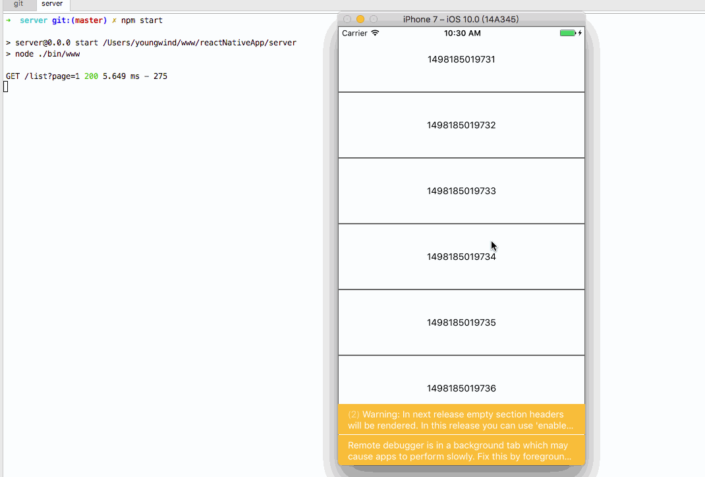

# 启动步骤

1. cd server && npm i && npm start ，启动本地服务器，提供假数据，端口为 3333
2. 修改 index.ios.js 文件中 Line 60 的 IP 地址，改成你自己电脑的 IP
2. cd 到项目根目录，npm i && react-native run-ios

# 实现效果：一个滚动的列表

# 功能点
- [x] ListView
- [ ] Navigation